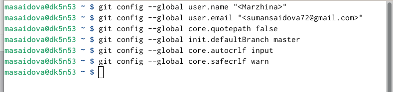
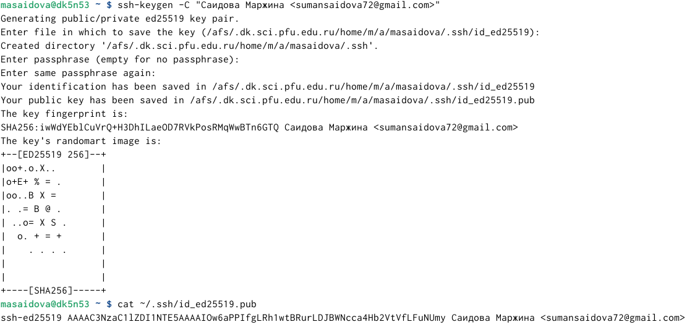
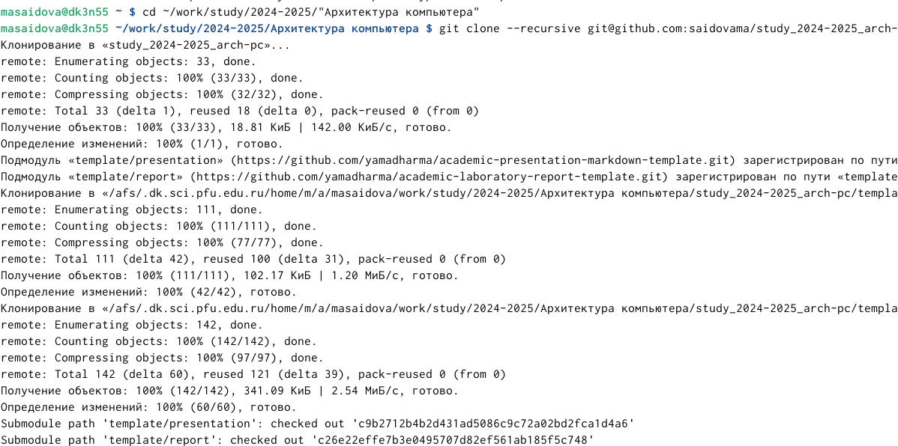
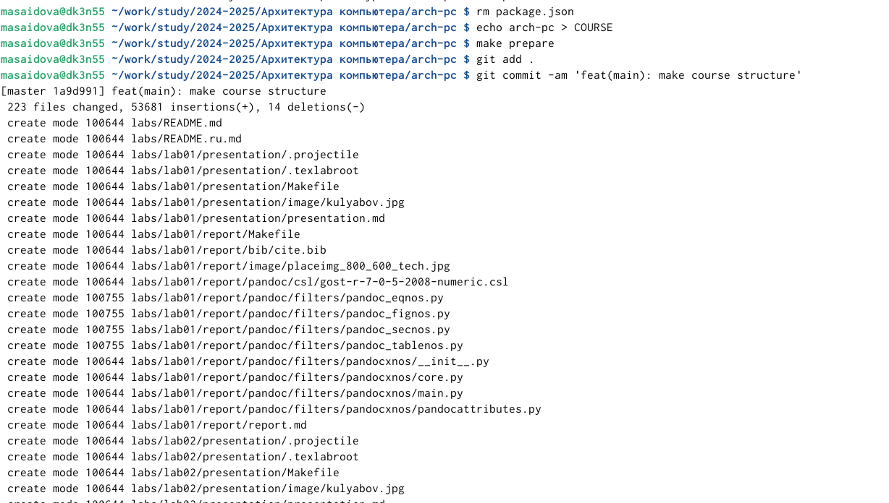
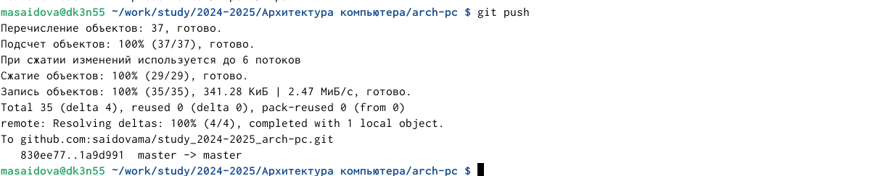

---
## Front matter
title: "Лабораторная работа 2"
subtitle: "Система контроля версий git"
author: "Саидова М.А."

## Generic otions
lang: ru-RU
toc-title: "Содержание"

## Bibliography
bibliography: bib/cite.bib
csl: pandoc/csl/gost-r-7-0-5-2008-numeric.csl

## Pdf output format
toc: true # Table of contents
toc-depth: 2
lof: true # List of figures
lot: true # List of tables
fontsize: 12pt
linestretch: 1.5
papersize: a4
documentclass: scrreprt
## I18n polyglossia
polyglossia-lang:
  name: russian
  options:
	- spelling=modern
	- babelshorthands=true
polyglossia-otherlangs:
  name: english
## I18n babel
babel-lang: russian
babel-otherlangs: english
## Fonts
mainfont: IBM Plex Serif
romanfont: IBM Plex Serif
sansfont: IBM Plex Sans
monofont: IBM Plex Mono
mathfont: STIX Two Math
mainfontoptions: Ligatures=Common,Ligatures=TeX,Scale=0.94
romanfontoptions: Ligatures=Common,Ligatures=TeX,Scale=0.94
sansfontoptions: Ligatures=Common,Ligatures=TeX,Scale=MatchLowercase,Scale=0.94
monofontoptions: Scale=MatchLowercase,Scale=0.94,FakeStretch=0.9
mathfontoptions:
## Biblatex
biblatex: true
biblio-style: "gost-numeric"
biblatexoptions:
  - parentracker=true
  - backend=biber
  - hyperref=auto
  - language=auto
  - autolang=other*
  - citestyle=gost-numeric
## Pandoc-crossref LaTeX customization
figureTitle: "Рис."
tableTitle: "Таблица"
listingTitle: "Листинг"
lofTitle: "Список иллюстраций"
lotTitle: "Список таблиц"
lolTitle: "Листинги"
## Misc options
indent: true
header-includes:
  - \usepackage{indentfirst}
  - \usepackage{float} # keep figures where there are in the text
  - \floatplacement{figure}{H} # keep figures where there are in the text
---

# Цель работы
Изучение идеологии и применения средств контроля версий, приобретение практических навыков по работе с системой git.

# Задание 

1) Настройка github
2) Базовая настройка git
3) Создание SSH ключа
4) Создание рабочего пространства и репозитория курса на основе шаблона
5) Создание репозитория курса на основе шаблона
6) Настройка каталога курса
7) Задание для самостоятельной работы

# Теоретическое введение

 Основные команды git

| Имя каталога                       | Описание каталога                                                                                                          |
|------------------------------------|----------------------------------------------------------------------------------------------------------------------------|
| `git pull`                         | Получение обновлений (изменений) текущего дерева из центрального репозитория                                               |
| `git add .`                        | Добавить все изменённые и/или созданные файлы и/или каталоги                                                               |
| `git push`                         | Отправка всех произведённых изменений локального дерева в центральный репозиторий                                          |
| `git commit -am 'Описание коммита` | Сохранить все добавленные изменения и все изменённые файлы                                                                 |

# Выполнение лабораторной работы
1. В пункте 2.4.2 требуется сделать базовую настройку git. (рис. 1)

{#fig:001 width=70%} 

2. В пункте 2.4.3 нужно создать SSH ключ. (рис. 2)

{#fig:002 width=70%}

3. В пунктах 2.4.4-2.4.5 требуется создать рабочее пространство и репозиторию курса на основе шаблона. (рис. 3 и 4)

{#fig:003 width=70%}

{#fig:004 width=70%} 

4. В пункте 2.4.6. требуется создать настройку каталога курса: удаление лишнего файла, создание необходимых каталогов, отправка файла на сервер (рис. 5 и 6) 

{#fig:005 width=70%} 

{#fig:006 width=70%} 

# Выводы

Ознакомилась с git, изучила ряд команд и подготовила рабочее пространство.
