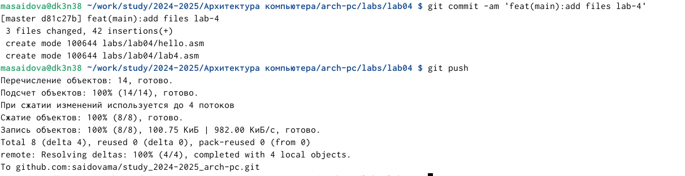

---
## Front matter
title: "Лабораторная работа №4"
subtitle: "Создание и процесс обработки программ на языке ассемблера NASM"
author: "Саидова Маржина Авдулвохидовна"

## Generic otions
lang: ru-RU
toc-title: "Содержание"

## Bibliography
bibliography: bib/cite.bib
csl: pandoc/csl/gost-r-7-0-5-2008-numeric.csl

## Pdf output format
toc: true # Table of contents
toc-depth: 2
lof: true # List of figures
lot: true # List of tables
fontsize: 12pt
linestretch: 1.5
papersize: a4
documentclass: scrreprt
## I18n polyglossia
polyglossia-lang:
  name: russian
  options:
	- spelling=modern
	- babelshorthands=true
polyglossia-otherlangs:
  name: english
## I18n babel
babel-lang: russian
babel-otherlangs: english
## Fonts
mainfont: IBM Plex Serif
romanfont: IBM Plex Serif
sansfont: IBM Plex Sans
monofont: IBM Plex Mono
mathfont: STIX Two Math
mainfontoptions: Ligatures=Common,Ligatures=TeX,Scale=0.94
romanfontoptions: Ligatures=Common,Ligatures=TeX,Scale=0.94
sansfontoptions: Ligatures=Common,Ligatures=TeX,Scale=MatchLowercase,Scale=0.94
monofontoptions: Scale=MatchLowercase,Scale=0.94,FakeStretch=0.9
mathfontoptions:
## Biblatex
biblatex: true
biblio-style: "gost-numeric"
biblatexoptions:
  - parentracker=true
  - backend=biber
  - hyperref=auto
  - language=auto
  - autolang=other*
  - citestyle=gost-numeric
## Pandoc-crossref LaTeX customization
figureTitle: "Рис."
tableTitle: "Таблица"
listingTitle: "Листинг"
lofTitle: "Список иллюстраций"
lotTitle: "Список таблиц"
lolTitle: "Листинги"
## Misc options
indent: true
header-includes:
  - \usepackage{indentfirst}
  - \usepackage{float} # keep figures where there are in the text
  - \floatplacement{figure}{H} # keep figures where there are in the text
---

# Цель работы

Освоение процедуры компиляции и сборки программ, написанных на ассемблере NASM.

# Задание

1. Создать каталог для работы с программами на языке ассемблера NASM
2. Перейти в созданный каталог
3. Создать текстовый файл с именем hello.asm
4. Открыть этот файл
5. Ввести в него указанный текст
6. Выполнить компиляцию в объектный код
7. Выполнить компиляцию исходного файла
8. Передать объектный файл на обработку компоновщику
9. Запустить исполняемый файл
10. Самостоятельная работа

# Теоретическое введение

Здесь описываются теоретические аспекты, связанные с выполнением работы.

Например, в табл. [-@tbl:std-dir] приведено краткое описание стандартных каталогов Unix.

: Описание некоторых каталогов файловой системы GNU Linux {#tbl:std-dir}

| Имя каталога | Описание каталога                                                                                                          |
|--------------|----------------------------------------------------------------------------------------------------------------------------|
| `/`          | Корневая директория, содержащая всю файловую                                                                               |
| `/bin `      | Основные системные утилиты, необходимые как в однопользовательском режиме, так и при обычной работе всем пользователям     |
| `/etc`       | Общесистемные конфигурационные файлы и файлы конфигурации установленных программ                                           |
| `/home`      | Содержит домашние директории пользователей, которые, в свою очередь, содержат персональные настройки и данные пользователя |
| `/media`     | Точки монтирования для сменных носителей                                                                                   |
| `/root`      | Домашняя директория пользователя  `root`                                                                                   |
| `/tmp`       | Временные файлы                                                                                                            |
| `/usr`       | Вторичная иерархия для данных пользователя                                                                                 |

Более подробно про Unix см. в [@tanenbaum_book_modern-os_ru; @robbins_book_bash_en; @zarrelli_book_mastering-bash_en; @newham_book_learning-bash_en].

# Выполнение лабораторной работы

1. Создание каталога, переход в каталог, создание текстового файла, открытие файла и введения текста в файл. 

{#fig:001 width=70%}

2. Компиляция текста, создания файлов, передача файла на компоновку, зададим имя создаваемого исполняемого файла. Запустим на выполнение созданный исполняемый файл, находящийся в текущем каталоге.

{#fig:002 width=70%} 

3. Самостоятельная работа: 
   3.1 Создадим копию файла hello.asm с именем lab4.asm
   3.2 Внести изменения в текст программы в файле lab4.asm.
   3.3 Транслирование полученного текста программа lab4.asm в объектный файл. Выполнение компоновки объектного файла и запуск получившегося исполняемого файла.
   
{#fig:003 width=70%}
   
{#fig:004 width=70%}

{#fig:005 width=70%}

   4. Скопировать файлы hello.asm и lab4.asm в локальный репозиторий
   
{#fig:006 width=70%} 

   5. Загрузить файлы на гитхаб
   
{#fig:007 width=70%}

{#fig:008 width=70%}

# Выводы

Ознакомилась с созданием и процессом обработки программ на языке ассемблера NASM

# Список литературы{.unnumbered}

::: {#refs}
:::
